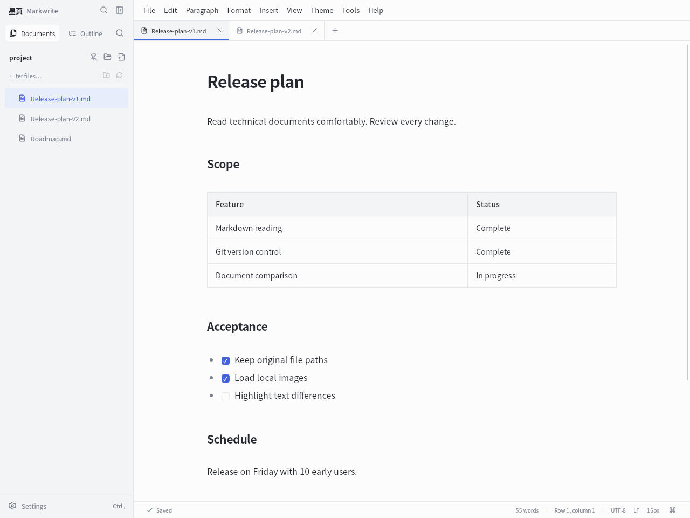
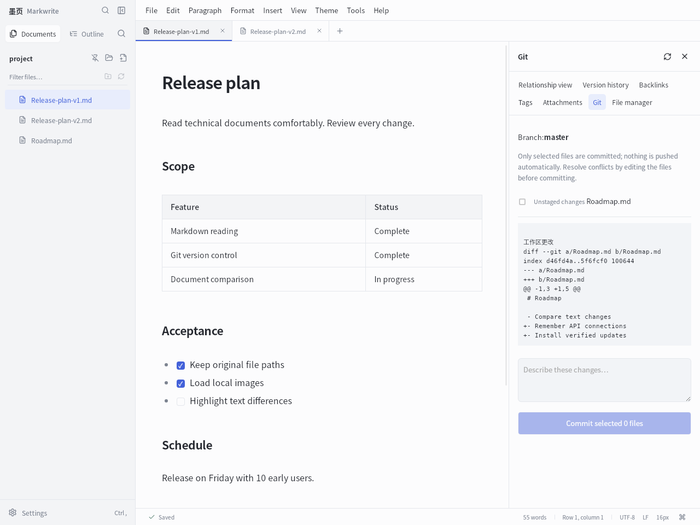
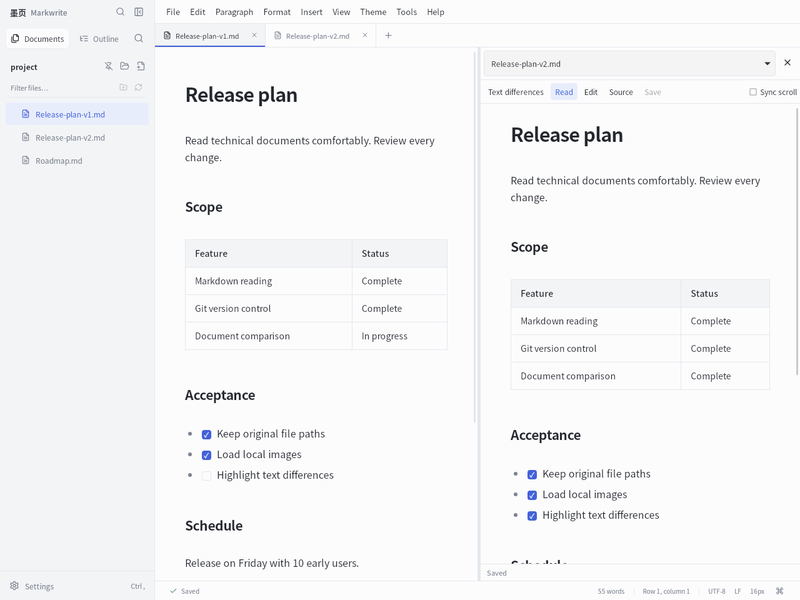
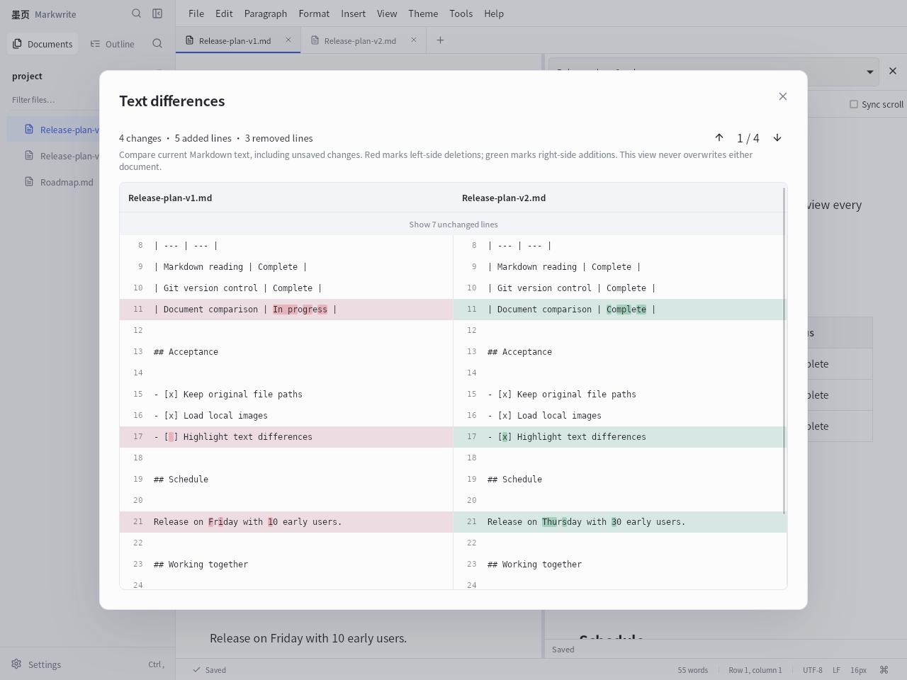
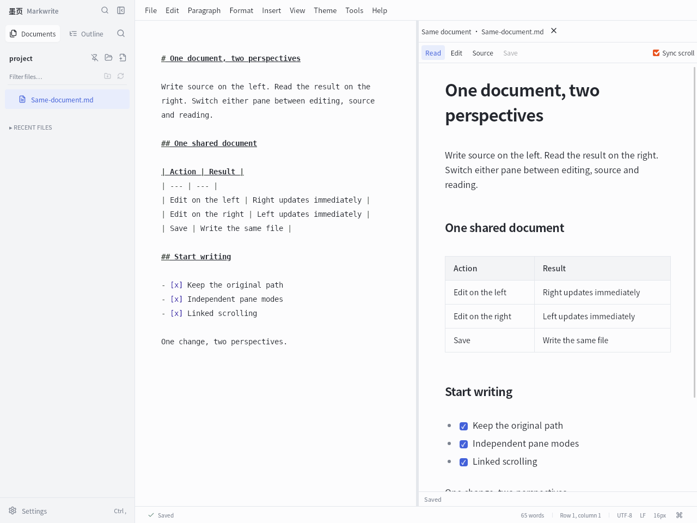
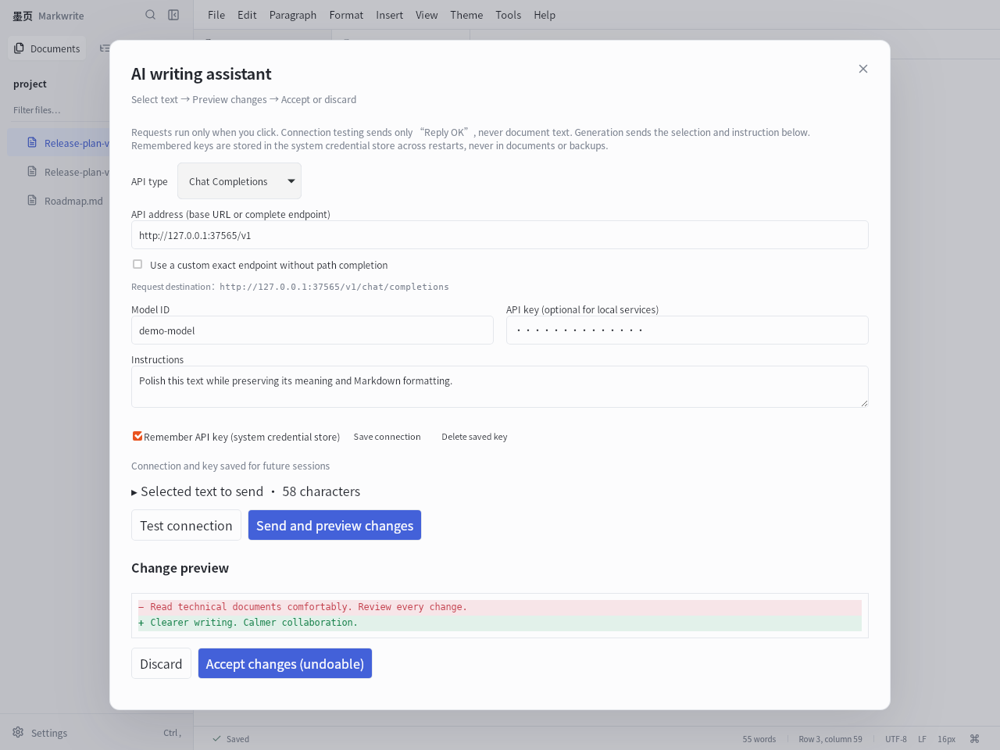
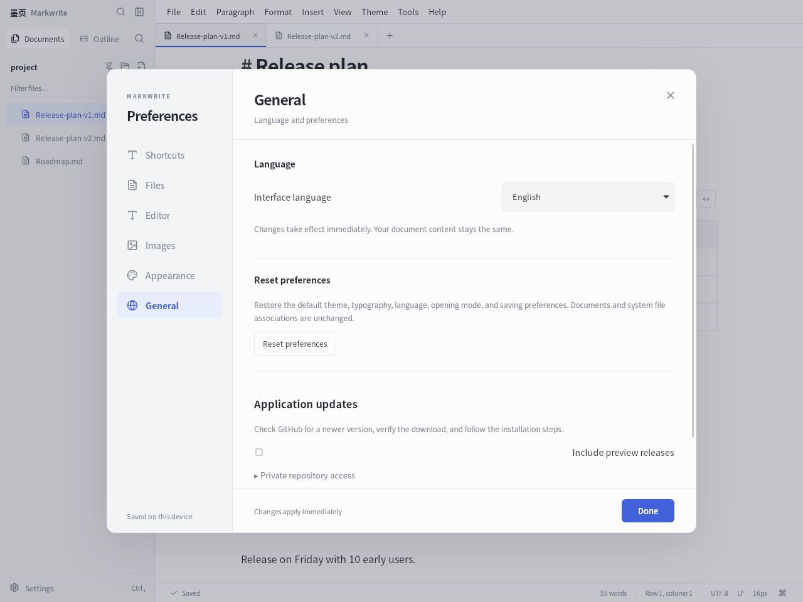
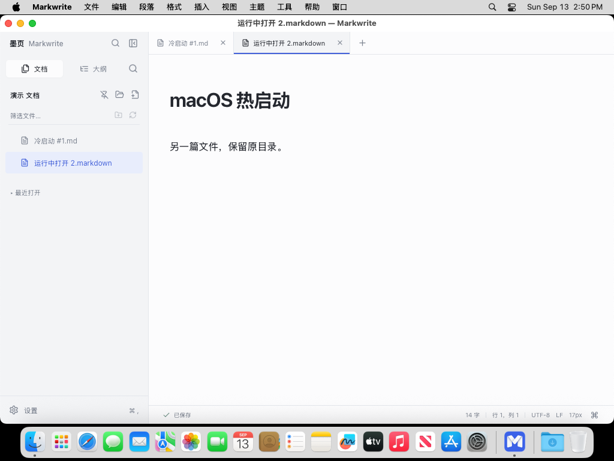

# Markwrite · English guide

[Download for Linux / Windows / macOS](https://github.com/asoming/markwrite/releases/latest) · [Overview](README.md) · [中文介绍](README.zh-CN.md)

Markwrite brings Markdown reading, visual formatting, document comparison, and Git version control into one desktop application. Your documents remain ordinary `.md` files in their original folders and repositories.

## A first look



Double-click a Markdown file to open it in reading mode. The sidebar can follow its parent folder. Move the pointer near the bottom-right corner to reveal reading, editing, source, and focus controls. The sidebar shows “墨页 Markwrite”; window titles and desktop shortcuts use Markwrite.

## 1. Git: review before you commit



Open **Tools → Git version control** for the current folder:

- Inspect the current branch, modified, untracked, staged, and conflicted files.
- Click a file to review its diff, select the files to include, and enter a commit message.
- Resolve conflicts in a three-way comparison. Choose your version, their version, the base, or both for each block, then save the result.
- Mark the saved conflict as resolved and complete the merge commit. Commit operations check for intervening disk and index changes.

Git must be installed on your computer. This workflow covers local review and commits; it does not automatically push. Use your preferred Git tools for remote synchronization. The screenshot uses a disposable test repository, not a personal repository.

## 2. Two documents: edit side by side and compare text



Open two documents and choose **View → Compare documents side by side**. Select another open document in the right pane. Each pane has its own reading, editing, source, undo, and save operations. Drag the divider or adjust it with the arrow keys. Linked scrolling follows the relative position in each document.

### What changed in the text?



Click **Text differences** in the right toolbar:

- Compare the **current Markdown text in both documents, including unsaved changes**.
- Red marks deletions on the left; green marks additions on the right. Modified lines also highlight individual characters, including Chinese text, numbers, and parameters.
- Keep original line numbers and jump to the previous or next change.
- Expand folded unchanged passages. Spaces, line endings, and a missing final newline participate in comparison.

This is a review view: it never overwrites either document. It compares text, including Markdown syntax, rather than image pixels or rendered page appearance. Linked scrolling uses relative positions; the text comparison aligns lines.

Diff computation runs in a Worker. The combined limit is two million characters or 12,000 lines. Complex comparisons stop with a clear timeout message instead of locking the interface. Larger files can still be read side by side.

### One document, independent views

Choose **View → Source + reading (same document)** with just one file open. It starts with source on the left and reading on the right. **Each pane independently supports editing, source and reading**, including editing/editing and reading/source. Use the existing mode controls for the left pane and the toolbar inside the right pane.

Edits in either pane immediately update the other. Both share one document and save state; no file copy is created. Each pane undoes its own edits, while changes from the other pane map through its cursor and undo history. Toggle **Sync scroll**, drag the divider to resize, or close the right pane to return to one view. Opening another file follows that file and resets the layout to source/reading.



## 3. AI: connect your service and review proposed edits



Select text in an editing pane and choose **Tools → AI writing assistant**. Connection settings are remembered. With **Remember API key** enabled, saving the connection or sending a request stores the key in the Linux system keyring or Windows Credential Manager or macOS Keychain. It remains available after restarting. You can delete a stored key separately.

### Connect a service

1. Select **Chat Completions, Responses, or Anthropic Messages**.
2. Enter the provider's base URL, such as `https://api.example.com/v1`, or a standard complete endpoint. The panel shows the **actual request URL**.
3. For a provider-specific complete route, enable **Use a custom complete path without automatic completion**.
4. Enter the exact model ID and API key. Local compatible servers can use `http://localhost:port/v1`; remote connections require HTTPS.
5. Click **Test connection**. No selection is required. The test asks for an “OK” response without sending document text; the provider may count it toward API usage.
6. Enter your instruction and click **Send and preview changes**. Accept or discard the proposal. Accepted edits remain undoable.

**HTTP 404:** check the displayed request URL first. A domain or `/v1` base is expanded to the standard route. Complete `/chat/completions`, `/responses`, and `/messages` routes select their matching protocol. If the URL is correct, check the model ID. HTTP 401/403 indicates authentication or permission problems; 429 indicates rate or quota limits. Provider error details are shown with the supplied key redacted.

AI is optional and does not include a hosted account or subscription. Bring your own API service, quota, or local model. Ordinary chat website URLs and OAuth sign-in pages are not API endpoints. Only the selected text and instruction are sent; selections are limited to 100KB. There is no automatic full-document submission, background upload, or automatic acceptance.

Keys are never written into Markdown, ordinary settings, or backups. If the system credential store is unavailable, unlock the login keyring or disable remembering to use a temporary key. The screenshot uses a local test service and is not evidence of a connection to a commercial provider.

## 4. Reading and writing

- **Original files first:** no vault import. Reading mode protects the source from accidental edits. Explicit saves and automatic saves check for external changes.
- **Format without memorizing syntax:** menus insert headings, lists, tasks, tables, links, images, code, math, and diagrams. Switch to source for precise changes.
- **Direct formatting:** edit table cells, paste multiple cells, and manage rows and columns. Adjust image size, alignment, captions, and links. Extended image formatting may be stored as HTML in Markdown.
- **Independent windows:** `Ctrl+Shift+N` opens a separate process. Drafts are isolated per window; disk conflicts are still checked when multiple windows open the same file.
- **Navigation:** outlines, reading positions, paragraph bookmarks, history, and previous/next files in a folder. Use `Ctrl+F` to search the current document, `Ctrl+P` to open a file quickly, and `Ctrl+K` for commands.
- **Markdown compatibility:** the CommonMark base parser is checked against all 652 official examples. Choose technical-document, GitHub, or strict CommonMark presets. Tables, tasks, footnotes, syntax highlighting, KaTeX, and Mermaid are available; compatibility extensions such as Wiki links are off by default.

## 5. Images and portable files

Paste a screenshot or copied image file in editing/source mode, or drag in an image. New images default to relative files in an `assets` folder beside the document. Save a new draft to a location first. Existing relative images stay in place; Chinese names, spaces, and authorized parent-folder paths are supported.

| Image storage | Sharing the document |
| --- | --- |
| Relative path | Send the `.md` and referenced images together, preserving relative folders. Use the document-and-attachments ZIP export. |
| Embedded Base64 | Image data lives inside the `.md`; send that file. The receiving renderer must support data images. Long encoded text in source view is expected. |
| Network URL | The recipient needs access to the URL. Images are not automatically downloaded or relocated. |

Editing and reading modes render supported images; source mode preserves the Markdown representation. Changing the image storage preference affects future insertions and does not silently convert all existing images.

## 6. Import, export, and sharing

The **File** menu imports TXT, HTML, and DOCX into separate drafts without overwriting the input. Export HTML, PDF, DOCX, or a document-and-attachments ZIP; copy formatted content into other editors.

PDF/DOCX options include paper size, margins, headers, footers, page numbers, a cover, and a table of contents. PDF has a paginated preview and can be printed using a system reader. Supported formulas become editable Office equations in DOCX, with image fallback for unsupported expressions. Diagrams are exported as graphics.

Complex Word/HTML layouts may not survive import exactly. Destination editors may filter pasted styles or embedded images. Word/WPS repagination determines final DOCX page numbers. PDF suits reading; Markdown with relative attachments is convenient for continued collaboration.

## 7. Workspace, recovery, and preferences



- Expand the file tree on demand. Workspace search, tags, backlinks, and relationships are indexed when needed, outside the ordinary single-file reading startup path.
- Automatic saves, draft recovery, external-change notices, and version history. On exit, save files, keep drafts, discard unsaved changes, or cancel. Discarding does not undo changes already saved to disk.
- Preview affected references before renaming or moving a document, then select the documents to update. Moving across filesystems is not supported.
- Independent local backups, manually or on an hourly schedule while the app is running. Restore into a new folder without overwriting the current workspace.
- Five document themes, custom fonts and colors, focus mode, floating-control opacity, customizable shortcuts, and Chinese/English UI.
- Import theme CSS, folders, or ZIPs with common Typora selectors and bundled fonts/images. Arbitrary third-party themes are not guaranteed to look pixel-identical.
- Document templates and declarative extensions reuse writing structures without executing arbitrary extension scripts.

## 8. Installation and updates

Choose a package from the [latest release](https://github.com/asoming/markwrite/releases/latest):

- **Debian/Ubuntu x86_64:** install the `.deb` with your system package installer. WebKitGTK 4.1 and other runtime dependencies are required.
- **Portable Linux:** extract the `.tar.gz` and run `scripts/launch.sh`. Run `scripts/install-desktop.sh` for an English desktop entry. System GTK/WebKit libraries are still required.
- **Windows 10/11 x64:** run `-setup.exe`. The installer checks WebView2 and may need a connection to download the runtime if it is absent.

Under **Settings → General → Check updates**, download and verify an available update, then click **Install update**. Choose how to handle unsaved documents first. The installer is checked again before execution. Portable Linux replaces its executable and keeps a backup; system Linux requests installation authorization; Windows launches the installer. Reopen Markwrite to use the new version. Save and close other Markwrite windows before installing on Windows. If installation fails to start, the current window and download are retained.

**Settings → Files** can configure the default Markdown application. Windows may require confirmation in system default-app settings.

## Limits and validation

- Supported platforms are Linux/Windows x86_64 and macOS 14+ (Apple Silicon / Intel). There is no mobile client, cloud synchronization, or real-time multiplayer editing.
- The per-file limit is 32MiB. Long reading views render on demand. Beyond 300,000 characters, live decorations are reduced; beyond one million, editor Markdown parsing pauses. Document size is not unlimited.
- **Startup is not consistently under one second.** Cache state, WebKit, fonts, and document size affect it.
- Your actual account, quota, proxy, and commercial provider need validation in your own environment. Protocol tests do not prove compatibility with every vendor.
- [Build records](https://github.com/asoming/markwrite/actions) include frontend/Rust tests, Windows installation/association/recovery/uninstall checks, and both Mac architectures’ DMG signatures, relocated launch, cold/warm Finder opening, and native menus. Screenshots show the actual running app, not mockups.

## Run from source

Stack: Tauri 2, React, TypeScript, Rust, and CodeMirror 6. Use Node.js 24 and Rust 1.88 or newer. On Linux, install the GTK/WebKit development libraries required by Tauri.

```bash
npm ci
npm run tauri dev
npm test
cargo test --manifest-path src-tauri/Cargo.toml --locked
```

Linux package: `npm run tauri -- build --bundles deb`.

Windows package: `npm run tauri -- build --config src-tauri/tauri.windows.conf.json --bundles nsis`.

macOS package (on a Mac with Xcode Command Line Tools): `npm run tauri -- build --bundles app,dmg`. This builds natively for the host CPU; CI uses separate Apple Silicon and Intel Macs.


When [reporting an issue](https://github.com/asoming/markwrite/issues), include your system, app version, steps, and error message. Do not attach API keys or private documents.


## Native macOS installation



1. Download `aarch64.dmg` for Apple Silicon (M-series), or `x64.dmg` for Intel. macOS 14 or newer is required.
2. Open the disk image and drag **Markwrite.app** into **Applications**, then launch the installed app.
3. Open Markdown from Finder with Markwrite, either from a cold start or while running. Paths, Unicode names, spaces, and relative image references remain intact.
4. Set the default Markdown application under **Markwrite → Settings → Files**. If macOS requires confirmation, use **Finder → Get Info → Open with → Change All**. TXT associations are not modified.
5. Commands use the macOS menu bar: `⌘S` saves, `⌘O` opens, `⌘,` opens settings, and `⌘⌥F` replaces text. `⌘H` remains the system Hide command. Quitting still prompts about unsaved edits.
6. Update checks select the correct native CPU package and verify SHA-256. Resolve unsaved documents before opening the new DMG, then replace the old app in Applications.

The application uses native Cocoa / WKWebView; no browser installation or Rosetta is needed. Git features require a local Git installation; reading, editing, and exports do not.

Builds are **ad-hoc signed and not Apple Developer ID notarized**. Follow [Apple’s first-launch guidance](https://support.apple.com/en-us/102445) if macOS requires confirmation; do not disable Gatekeeper. Native builds, bundle signatures and Finder startup are checked in GitHub Actions. Chinese IME composition, trackpad gestures and physical multi-display behavior still need human Mac testing. The image above was captured from the running app on macOS CI; other feature screenshots were captured on Linux. macOS uses native menus and file dialogs.
