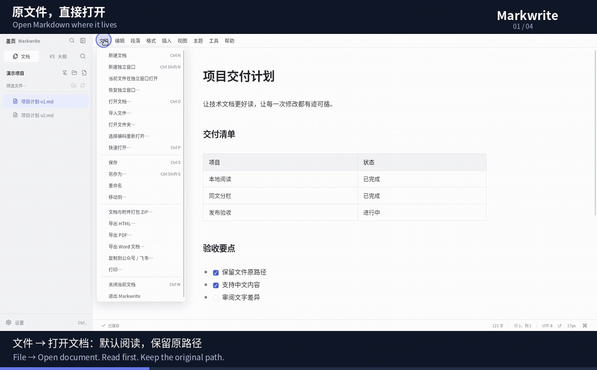
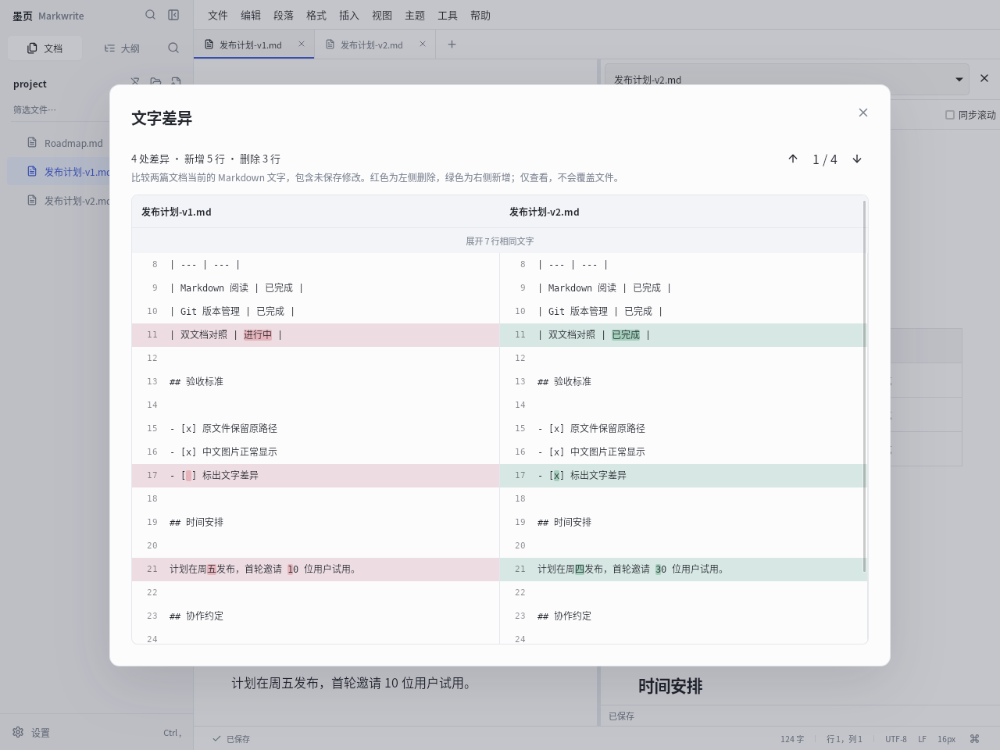

# Markwrite

**文件在原处，修改看得见。**

**Your files, with changes you can see.**

### [下载正式版 / Download for Linux, Windows & macOS](https://github.com/asoming/markwrite/releases/latest)

| 系统 / System | 安装包 / Installer |
| --- | --- |
| macOS 14+ · Apple Silicon（M 系列） | [原生 ARM64 DMG](https://github.com/asoming/markwrite/releases/download/v1.2.1/Markwrite_1.2.1_aarch64.dmg) |
| macOS 14+ · Intel | [原生 x64 DMG](https://github.com/asoming/markwrite/releases/download/v1.2.1/Markwrite_1.2.1_x64.dmg) |
| Windows 10/11 · x64 | [安装程序 / Setup](https://github.com/asoming/markwrite/releases/download/v1.2.1/Markwrite_1.2.1_x64-setup.exe) |
| Linux · x86_64 | [Debian / Ubuntu](https://github.com/asoming/markwrite/releases/download/v1.2.1/Markwrite_1.2.1_amd64.deb) · [便携包 / Portable](https://github.com/asoming/markwrite/releases/download/v1.2.1/Markwrite_1.2.1_linux_x86_64.tar.gz) |

Mac 包为 ad-hoc 签名，未完成 Apple Developer ID 公证；首次打开说明见[中文指南](README.zh-CN.md#macos-原生安装与操作)。 / Mac builds are ad-hoc signed, not Developer ID notarized; see the [Mac installation guide](README.en.md#native-macos-installation).

[中文功能介绍](README.zh-CN.md) · [English guide](README.en.md) · [发布记录 / Releases](https://github.com/asoming/markwrite/releases) · [反馈问题 / Issues](https://github.com/asoming/markwrite/issues/new/choose) · [MIT](LICENSE)

Markwrite（墨页）是一款本地 Markdown 阅读与编辑工具。直接打开磁盘文件，在同一个应用中阅读、排版、比较文字修改，并用 Git 管理版本。无需导入知识库或注册账号。

Markwrite is a local Markdown reader and editor. Open files where they live, write and format text, compare revisions, and review Git changes in one application. No vault or account required.

## 31 秒看操作 / A 31-second tour

**打开原文件 → 同文源码与阅读 → 双文逐字对照 → Git 审阅并提交。**

**Open a file → view source and reading side by side → compare text changes → review and commit with Git.**

[观看或下载 MP4 / Watch or download MP4](https://github.com/asoming/markwrite/releases/download/v1.2.1/Markwrite-quick-tour.mp4) · Linux 桌面实录，配中英字幕，无声；界面可能随版本调整。 / Recorded on Linux with Chinese and English captions, no audio; appearance may vary by version.

## 为技术文档整合的能力 / Built for technical documents

| 能力 / Capability | 实际用途 / What you can do |
| --- | --- |
| **Git 版本管理 / Git version control** | 查看文件状态与差异，选择文件提交，逐块解决三方冲突。 / Review changes, commit selected files, and resolve three-way conflicts. |
| **同一文档分栏 / One document, two panes** | 左右独立切换编辑、源码、阅读；修改实时同步，只保存一个文件。 / Independently switch each pane between editing, source and reading, with one shared file. |
| **双文档与文字差异 / Dual documents and text differences** | 两边独立编辑、同步滚动；按行对齐并标出字级新增与删除。 / Edit both documents, link scrolling, and inspect aligned line and character changes. |
| **原文件优先 / Original files first** | 双击打开任意 Markdown；默认阅读，文件树跟随父目录。 / Open Markdown anywhere in reading mode, with its parent folder tree. |
| **可选择的 AI 助手 / Optional AI assistance** | 自带 API，测试连接，预览再接受修改；密钥可存系统凭据库。 / Bring your API, test connections, preview edits, and keep keys in the OS credential store. |
| **可携带的文档 / Portable documents** | 相对图片、内嵌图片、文档附件 ZIP，以及 HTML / PDF / DOCX 导出。 / Relative or embedded images, attachment ZIPs, and HTML / PDF / DOCX export. |

重点面向 README、技术方案、论文笔记和项目文档的本地审阅与版本管理。

Built around local review and version control for READMEs, technical plans, research notes, and project documentation.

## 选择你的语言 / Choose your guide

- **[中文介绍](README.zh-CN.md)**：功能截图、安装、Git、对照、AI 接入与常见问题。
- **[English guide](README.en.md)**: screenshots, installation, Git, comparisons, AI setup, and limitations.

**平台 / Platforms:** Linux x86_64（Debian/Ubuntu `.deb`、便携包 / portable archive）；Windows 10/11 x64（安装程序 / installer）；macOS 14+（Apple Silicon / Intel 原生 `.dmg`）。

**核心离线 / Offline core:** 本地阅读、编辑、Git 和附件处理不需要云账号。AI、远程图片、发布与更新检查仅在你主动使用时联网。 / Local reading, editing, Git, and attachments need no cloud account. AI, remote images, publishing, and update checks connect only when requested.

**技术栈 / Stack:** Tauri 2 · React · TypeScript · Rust · CodeMirror 6.

**源码版本 / Source version:** 1.2.1。已发布安装包以[最新发布页](https://github.com/asoming/markwrite/releases/latest)为准。 / See the latest release page for available installers.

## 参与和授权 / Contributing and license

遇到问题或有使用建议？使用[问题与功能建议表单](https://github.com/asoming/markwrite/issues/new/choose)。代码、翻译和文档贡献请看[贡献指南](CONTRIBUTING.md)。

Use the [bug and feature request forms](https://github.com/asoming/markwrite/issues/new/choose) to share feedback. See [Contributing](CONTRIBUTING.md) for development, checks, and pull requests.

Markwrite 原创代码采用 [MIT 许可证](LICENSE)。第三方依赖、主题和字体保留各自许可证；见[主题说明](public/themes/NOTICE.txt)与[字体说明](public/fonts/NOTICE.txt)。 / Original Markwrite code is MIT-licensed. Third-party dependencies, themes, and fonts retain their respective licenses; see the [theme](public/themes/NOTICE.txt) and [font](public/fonts/NOTICE.txt) notices.

**macOS:** 使用 Cocoa 系统菜单、⌘ 快捷键、Finder 文件关联与 Keychain。Apple Silicon 与 Intel 分别提供原生安装包，无需 Rosetta。当前采用 ad-hoc 签名，未完成 Apple Developer ID 公证；首次打开可能需在系统隐私与安全性中确认。 / Native Cocoa menus, Command shortcuts, Finder associations, and Keychain. Separate native builds for Apple Silicon and Intel; no Rosetta required. Ad-hoc signed, not Developer ID notarized; macOS may require first-launch approval.
