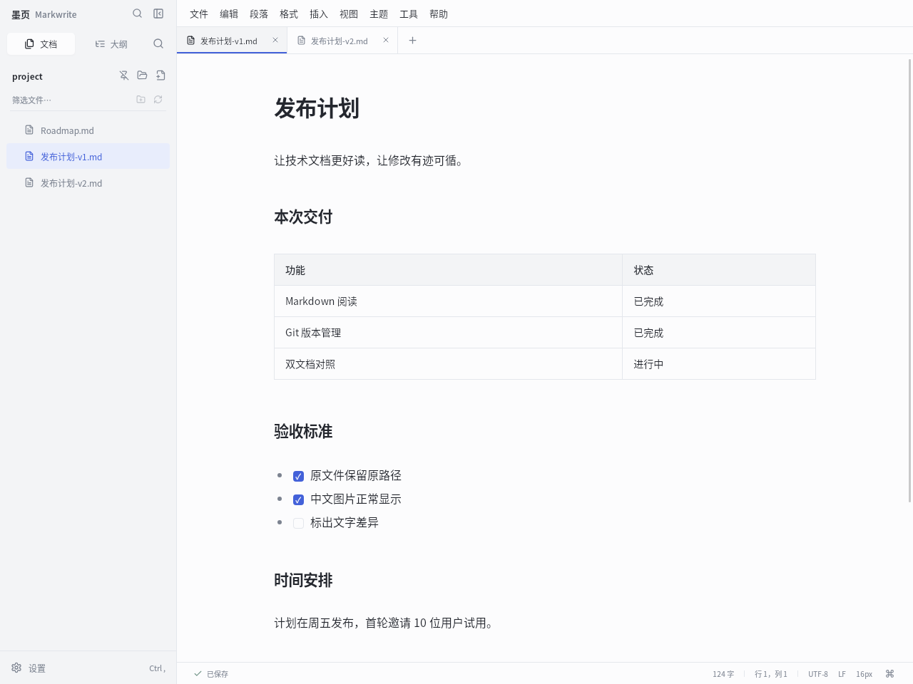
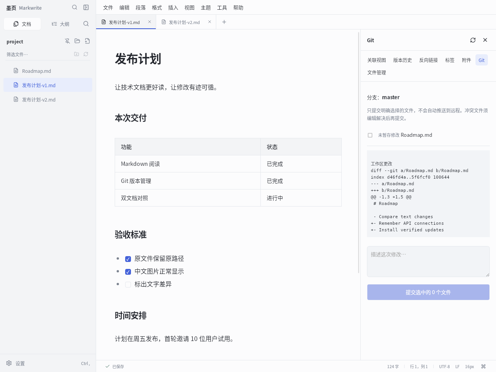
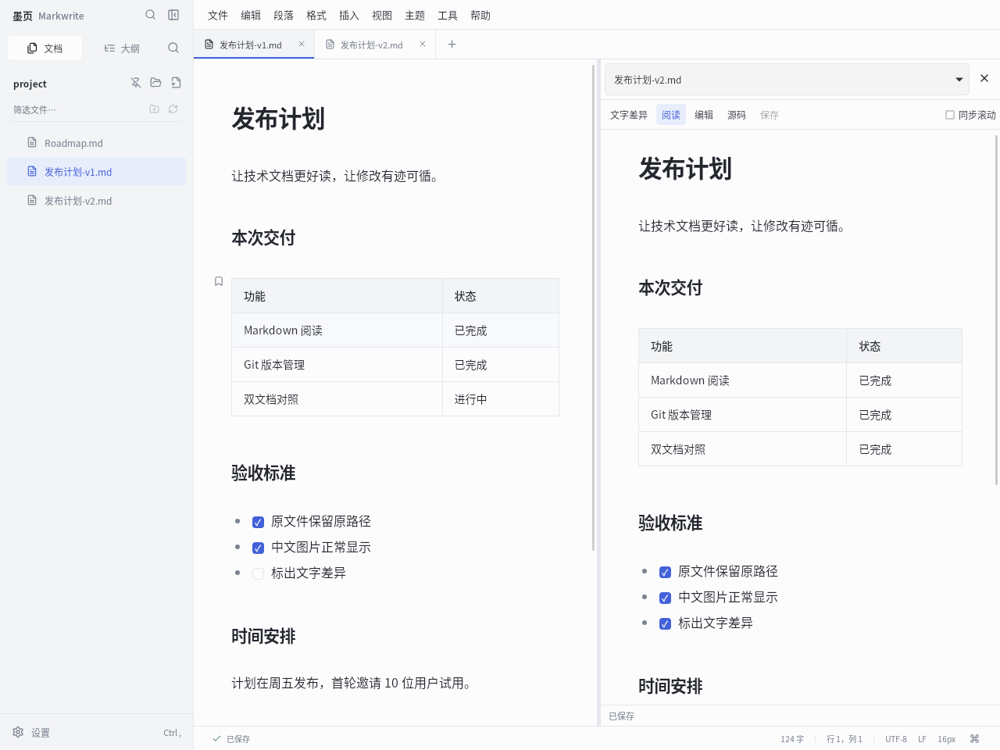
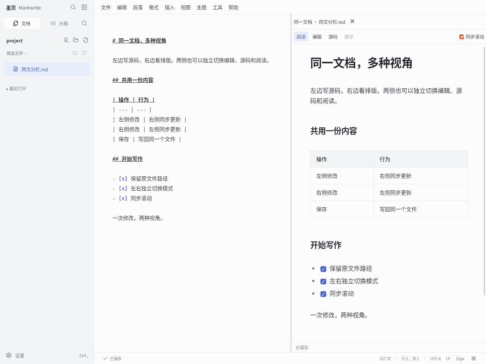
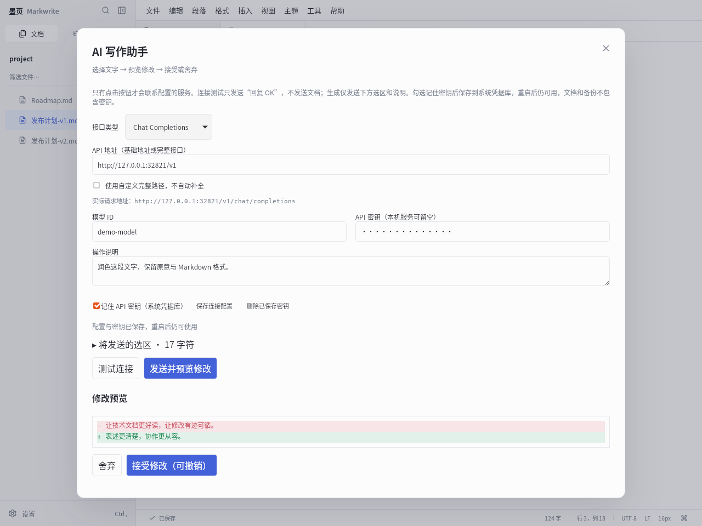
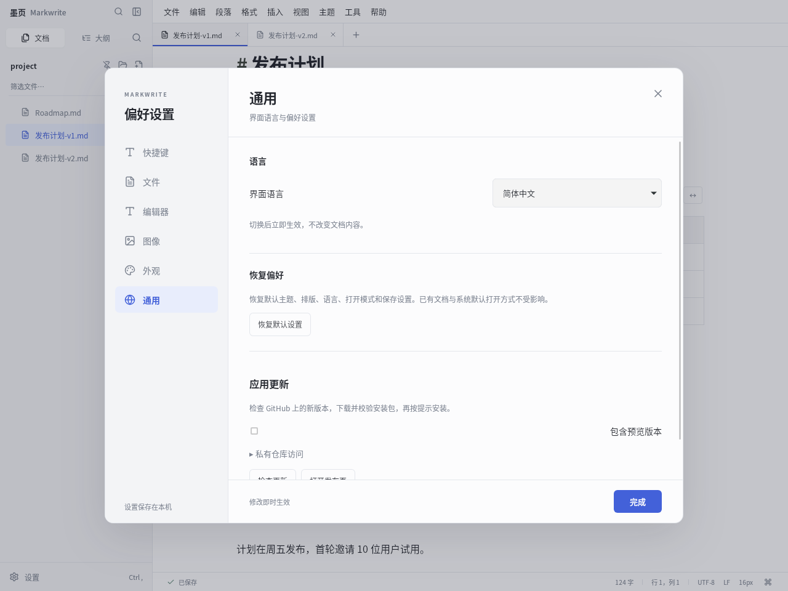

# 墨页 Markwrite · 中文介绍

[下载 Linux / Windows / macOS 正式版](https://github.com/asoming/markwrite/releases/latest) · [总览](README.md) · [English](README.en.md)

Markwrite 把 Markdown 阅读、可视化排版、双文档审阅和 Git 版本管理放到同一个窗口里。文件仍是普通 `.md`，保留原来的文件夹、项目和 Git 目录结构。

## 先看效果



双击磁盘上的 Markdown 默认进入阅读模式。左侧按需显示文件所在目录；右下角浮动工具条在鼠标靠近时出现，可切换阅读、编辑、源码和专注模式。侧栏显示「墨页 Markwrite」，窗口和桌面快捷方式统一使用 Markwrite。

## 1. Git：先审阅，再提交



从「工具 → Git 版本管理」打开当前文件夹的仓库：

- 查看当前分支、已修改、未跟踪、已暂存及冲突文件。
- 点击文件查看 Git 差异，勾选明确要提交的文件并填写提交说明。
- 冲突时打开三方比较，按块选择自己的版本、对方版本、基线或保留双方，再保存解决结果。
- 保存后标记已解决，完成合并提交。提交过程中检查磁盘和索引是否发生变化。

需要本机安装 Git。此功能面向本地审阅与提交，不会自动 push；远程同步继续使用你熟悉的 Git 工具。这里展示的是实际测试仓库，没有连接或上传个人仓库。

## 2. 双文档：并排编辑，也能比较文字



先打开两篇文档，再选择「视图 → 文档并排对照」。右栏可选择另一篇已打开文档，两边分别切换阅读、编辑或源码，有各自的编辑、撤销和保存操作。中间分隔线可拖动，也可用方向键调整；「同步滚动」按两边的相对位置联动。

### 文字本身哪里变了？


点击右栏的「文字差异」：

- 比较两篇文档**当前的 Markdown 文字，包含未保存内容**。
- 红色表示左侧删除，绿色表示右侧新增；同一行的修改继续细化到字符，适合中文、数字和参数修改。
- 显示左右原始行号、差异数量，通过上一处／下一处跳转。
- 相同的大段文字折叠，点击即可展开。空格、换行和文件末尾是否有换行也参与比较。

此视图只审阅，不会把一篇覆盖到另一篇。它比较文字内容，包含 Markdown 语法，不是图片像素或渲染页面的视觉比较。同步滚动按比例联动；文字差异视图按行对齐。

为防止卡住界面，差异计算在 Worker 中进行。两篇合计上限 200 万字符、12,000 行，复杂差异超时会明确提示；超过限制仍可使用普通并排阅读。

### 同一篇文档，左右不同视图

选择「视图 → 源码 + 阅读（同一文档）」，只打开一篇文档即可使用。初始左侧源码、右侧阅读；**左右都能独立切换编辑、源码、阅读**，包括编辑＋编辑、阅读＋源码等组合。左侧用原有模式按钮，右侧用栏内模式按钮。

任一侧修改都会同步到另一侧，两侧共用一个文档和保存状态，不创建副本。各侧撤销自己的编辑；另一侧的修改会映射到本侧光标和撤销历史。可勾选「同步滚动」、拖动中间分隔线调节宽度，点击右侧关闭按钮返回单栏。切换到其他文件时，分栏跟随该文件并回到左源码、右阅读。



## 3. AI：连接自己的服务，预览后再修改



在编辑模式选择一段文字，打开「工具 → AI 写作助手」。连接配置会记住；勾选「记住 API 密钥」后，点击「保存连接配置」或发送请求，密钥保存到 Linux 系统密钥环、Windows 凭据管理器或 macOS Keychain，重启后仍可使用。可以单独删除已保存密钥。

### 接入步骤

1. 选择协议：**Chat Completions、Responses 或 Anthropic Messages**。
2. 输入服务商的基础地址，如 `https://api.example.com/v1`，也可填写标准完整接口地址。界面会显示**实际请求地址**。
3. 对于服务商自定义的完整路径，勾选「使用自定义完整路径，不自动补全」。
4. 填写准确的模型 ID 和 API 密钥。本机兼容服务可用 `http://localhost:端口/v1`；远程地址要求 HTTPS。
5. 点击「测试连接」。即使还没选中文字也可测试；测试只发送“回复 OK”，不发送文档，但服务商可能计入 API 用量。
6. 填写操作说明，点击「发送并预览修改」。审阅差异后选择接受或舍弃；接受后仍可撤销。

**遇到 404：**先看实际请求地址。只填域名或 `/v1` 时会补全标准路径；完整 `/chat/completions`、`/responses`、`/messages` 会识别对应协议。若地址正确，检查模型 ID。401/403 是密钥或权限问题，429 是限流或额度问题；服务端返回的具体错误会显示，已填写密钥会从错误详情中遮蔽。

AI 不是内置账号或订阅。需要你自己的 API 服务、额度或本机模型；不支持把普通网页聊天地址当 API，也不代替 OAuth 登录。每次只发送选区及说明，选区最多 100KB。没有自动发送全文、后台上传或自动接受修改。

密钥不写入 Markdown、普通设置文件或备份。系统凭据库不可用时会说明原因；解锁系统密钥环，或取消记住密钥后临时使用。截图中的模型和地址来自隔离的本地测试服务，不是商业服务接入证明。

## 4. 阅读与写作

- **原文件优先：**无需导入知识库；默认只读浏览，误触不会修改源文件。切换编辑后才进行编辑，明确保存或自动保存会检查外部修改。
- **不必背语法：**菜单可以插入标题、列表、任务、表格、链接、图片、代码、公式与图表；随时可切到源码精确修改。
- **直接排版：**表格单元格编辑、多格粘贴、行列操作；图片尺寸、对齐、图注、重新链接及预览。尺寸和图注等扩展排版可能以 HTML 写入 Markdown。
- **独立窗口：**`Ctrl+Shift+N` 新建独立进程窗口，支持并排摆放。各窗口草稿独立，打开同一文件时仍检查磁盘冲突。
- **导航：**大纲、阅读位置、段落书签、历史前进后退、同目录上一篇／下一篇；`Ctrl+F` 阅读查找，`Ctrl+P` 快速打开，`Ctrl+K` 命令面板。
- **Markdown：**CommonMark 基础解析经过官方 652 个示例验证；可选技术文档、GitHub、严格 CommonMark 预设。支持表格、任务、脚注、代码高亮、KaTeX 和 Mermaid；Wiki 链接等兼容扩展默认关闭。

## 5. 图片与传文件

复制截图、复制图片文件或拖入图片后，在编辑／源码模式粘贴。默认将新图片保存为文档旁 `assets` 下的相对路径；新草稿先选择保存位置。已有相对路径图片保留原位置，中文、空格和授权范围内的父级路径可以读取。

| 保存方式 | 发给别人时怎么做 |
| --- | --- |
| 相对路径 | `.md` 和被引用的图片一起发送，保持相对目录；可用「文档与附件打包 ZIP」。 |
| 内嵌 Base64 | 图片数据就在 `.md` 内，只传文件；接收端需要支持 data 图片。源码显示长编码是正常的。 |
| 网络链接 | 接收端需要访问对应网址；网络图片不会自动下载或迁移。 |

编辑／阅读模式显示图片；源码保留 Markdown。选择图片保存方式影响以后插入的图片，不会默默转换原文全部图片。

## 6. 导入、导出与分享

「文件」菜单可导入 TXT、HTML、DOCX，为独立草稿，不覆盖原始输入文件。导出 HTML、PDF、DOCX、文档附件 ZIP，也可复制带格式的内容到其他编辑器。

PDF/DOCX 支持纸型、页边距、页眉页脚、页码、封面和目录。PDF 有实际分页预览；可用系统阅读器打印。支持的公式在 DOCX 中输出可编辑 Office 公式，不支持的表达式提供图片回退；图表为图形。

复杂 Word/HTML 导入不保证还原全部版式。第三方编辑器可能过滤粘贴样式或内嵌图片；DOCX 重新排版后的页码取决于 Word/WPS。只需阅读时，PDF 更方便；继续协作时，Markdown 与相对附件更容易维护。

## 7. 工作区、恢复与个性化



- 文件树按需展开；工作区搜索、标签、反向链接和关联视图按需建立索引，不参与普通单篇阅读的启动。
- 自动保存、草稿恢复、外部修改提示及版本历史。退出时可保存文件、保留草稿、不保存并退出或取消；丢弃不会回退已经保存到磁盘的内容。
- 重命名／移动前预览受影响引用，选择要同步保存的文档；跨文件系统移动不支持。
- 独立本地备份，可手动或按小时计划执行；自动备份需要应用运行。恢复到新的文件夹，不覆盖当前工作区。
- 五种文档主题、自定义字体颜色、专注模式、浮动工具透明度、自定义快捷键、中英文切换。
- 可导入主题 CSS、文件夹或 ZIP，适配常见 Typora 选择器和包内字体图片；不保证任意第三方主题像素一致。
- 文档模板和声明式扩展用于复用写作结构；不会执行任意扩展脚本。

## 8. 安装和更新

从[最新发布页](https://github.com/asoming/markwrite/releases/latest)选择：

- **Debian/Ubuntu x86_64：**下载 `.deb`，用系统软件安装器安装；需要 WebKitGTK 4.1 等依赖。
- **Linux 便携版：**解压 `.tar.gz` 后运行 `scripts/launch.sh`；执行 `scripts/install-desktop.sh` 创建英文桌面入口。仍需要系统 GTK/WebKit 运行库。
- **Windows 10/11 x64：**运行 `-setup.exe`。安装程序会检测 WebView2，未安装时可能需要联网获取运行库。

「设置 → 通用 → 检查更新」发现新版本后，可下载并校验安装包，再点「安装更新」。先选择如何处理未保存文档，安装前重新校验文件：Linux 便携版原位替换程序并保留备份；系统版通过系统授权安装；Windows 打开安装向导。重新打开 Markwrite 使用新版。Windows 安装前须保存并关闭其他 Markwrite 窗口。失败时保留当前窗口和下载文件。

「设置 → 文件」可设置 Markdown 默认打开方式；Windows 可能要求在系统默认应用页确认。

## 边界与验证

- 支持的平台为 Linux/Windows x86_64 和 macOS 14+（Apple Silicon / Intel）；没有移动端、云同步或实时多人协作。
- 单文件上限 32MiB。长文阅读按需渲染；超过 30 万字符时减少常规即时装饰，超过 100 万字符时暂停编辑器 Markdown 语法解析。并非无限大小。
- **尚未稳定达到 1 秒启动。** 实际耗时受系统缓存、WebKit、字体和文档大小影响。
- API 的实际账号、额度、代理和商业服务兼容需在你的环境验证；功能测试不代表每家服务都已接入。
- [构建记录](https://github.com/asoming/markwrite/actions)包含前端/Rust 测试和 Windows 安装、关联、进程恢复及卸载检查。截图来自本机隔离测试环境；不是概念图。

## 从源码运行

技术栈：Tauri 2、React、TypeScript、Rust、CodeMirror 6。使用 Node.js 24 和 Rust 1.88 或更新版本；Linux 安装 Tauri 所需 GTK/WebKit 开发库。

```bash
npm ci
npm run tauri dev
npm test
cargo test --manifest-path src-tauri/Cargo.toml --locked
```

Linux 打包：`npm run tauri -- build --bundles deb`。

Windows 打包：`npm run tauri -- build --config src-tauri/tauri.windows.conf.json --bundles nsis`。

[反馈问题或建议](https://github.com/asoming/markwrite/issues)时请说明系统、版本、复现步骤和错误信息，勿附带 API 密钥或私人文档。


## macOS 原生安装与操作

1. 从发布页下载 Apple Silicon 的 `aarch64.dmg`（M 系列）或 Intel 的 `x64.dmg`。
2. 打开 DMG，将 **Markwrite.app** 拖入 **Applications（应用程序）**，再从应用程序目录启动。最低 macOS 14。
3. Finder 中右键 Markdown → 打开方式 → Markwrite；程序未启动或已运行都能接收文件，中文、空格和相对图片路径保持原样。
4. 「Markwrite → 设置 → 文件」可设置 Markdown 默认打开方式。若系统要求确认，在 Finder 的「显示简介 → 打开方式 → 全部更改」中完成；不会更改 TXT 的默认应用。
5. 菜单位于 macOS 系统菜单栏。保存为 `⌘S`，打开为 `⌘O`，设置为 `⌘,`，替换为 `⌘⌥F`；`⌘H` 保留系统隐藏行为。退出前仍会询问未保存修改。
6. 「检查更新」选择对应芯片的安装包并校验 SHA-256；打开安装镜像前处理未保存内容，再拖入 Applications 替换旧版。

应用原生使用 Cocoa / WKWebView，无需安装浏览器或 Rosetta。Git 功能仍需要本机 Git；阅读、编辑和导出不依赖 Git。

当前构建采用 **ad-hoc 签名，尚无 Apple Developer ID 公证**。首次运行如被拦截，请按 [Apple 官方打开说明](https://support.apple.com/zh-cn/102445) 在系统「隐私与安全性」中确认来源后打开，无需关闭 Gatekeeper。构建、签名完整性和 Finder 启动以 GitHub Actions 验收结果为准；中文输入法组合、触控板手势和实体多显示器仍需 Mac 人工验收。功能截图目前来自 Linux，Mac 的系统菜单和文件选择窗口不同。
